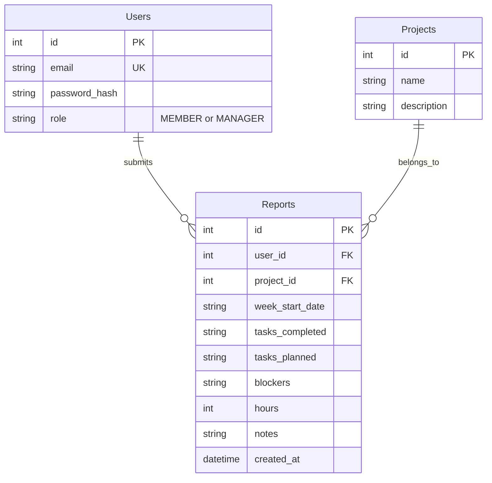

# Weekly Report Generator & Team Dashboard

This is a full-stack web application designed for team members to submit structured weekly reports and for managers to view and analyze those reports through a consolidated dashboard.

## Features

- **Role-Based Authentication**: Distinct views for Members and Managers.
- **Member Dashboard**: Submit standardized weekly reports, view past report history.
- **Manager Dashboard**: Comprehensive overview with Recharts visual data, project stats, and aggregated metrics.
- **AI Chat Assistant**: Ask questions about team activity and blockers.
- **Axion Studio UI**: The landing page and overarching design language incorporate the specific, premium "Axion Studio" brand requirements (animations, specific layouts, and styling).

## Tech Stack

- **Frontend**: React, Vite, Tailwind CSS, React Router, Recharts, Lucide React
- **Backend**: Node.js, Express, better-sqlite3, JWT
- **Database**: SQLite (No external DB installation required)

## Setup Instructions

### Prerequisites
- Node.js (v18+ recommended)
- npm

### 1. Database Initialization & Backend
1. Open a terminal and navigate to the `backend` directory.
2. Run `npm install`
3. Initialize the database and seed it by running:
   ```bash
   node src/db/init.js
   ```
4. Start the backend server:
   ```bash
   node src/server.js
   ```
   *(The server will run on `http://localhost:3001`)*

### 2. Frontend setup
1. Open a new terminal and navigate to the `frontend` directory.
2. Run `npm install`
3. Start the Vite development server:
   ```bash
   npm run dev
   ```
4. Open the displayed local URL in your browser (usually `http://localhost:5173`).

### 3. Demo Accounts
The database initialization script automatically creates an admin account:
- **Email**: `admin@axion.studio`
- **Password**: `admin123`
- **Role**: `MANAGER`

To test the member flow, click "Login / Portal" -> "Register" and create a new account.

---

## ER Diagram


